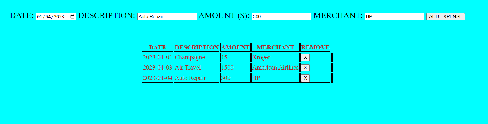

# Expense Tracker

## Description
I used HTML, CSS and Javascript to create a web-based expense tracker.  My goal in this project was to practice dynamically generating table elements with user input and then selecting rows to delete by using DOM child and parent selectors.  

TRY IT <a href='https://cdb8987.github.io/expense-tracker/'>HERE</a>

Author
Charles Brinkman https://www.linkedin.com/in/charlesbrinkman/